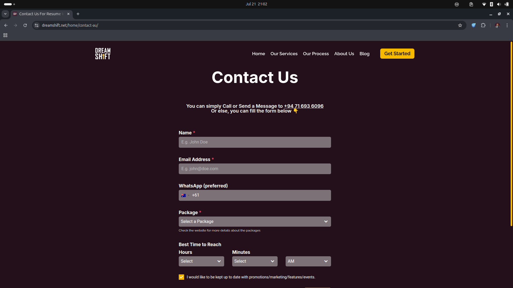

[](https://dreamshift.net)

# 🌍 GeoRedirect Scripts for Country-Based Routing

This project contains lightweight JavaScript snippets that dynamically redirect users to country-specific pages based on their IP address. These scripts are used in production on [Your Company Name]'s website to tailor the user experience by location.

## 🚀 Features

- Detects the user's country using the [ipapi.co](https://ipapi.co/) API.
- Redirects users to location-specific pages for:
  - Contact (`/contact-XX`)
  - Home (`/home-XX`)
  - Pricing (`/pricing-XX`)
- Fallback routes for unsupported countries.
- Easily extendable to support more regions.

  ## 📦 Dependencies

This project relies on the following external services:

- [`ipapi.co`](https://ipapi.co/) — for IP-based geolocation lookup (free tier available)
  - Used to detect the user’s country based on their IP address.
  - No installation required; fetched using the Fetch API in the browser.
 
  ## 📸 Snapshots

  
 - Home Page


- Services


- Pricing


- Contact


## 🧠 How It Works

Each script fetches the user's country code from `https://ipapi.co/json/` and performs a client-side redirect based on the result.

```javascript
fetch('https://ipapi.co/json/')
  .then(response => response.json())
  .then(data => {
    let country = data.country;

    switch(country) {
      case "LK":
        window.location.href = "/home-lk";
        break;
      case "US":
        window.location.href = "/home-us";
        break;
      // ...
    }
  });
